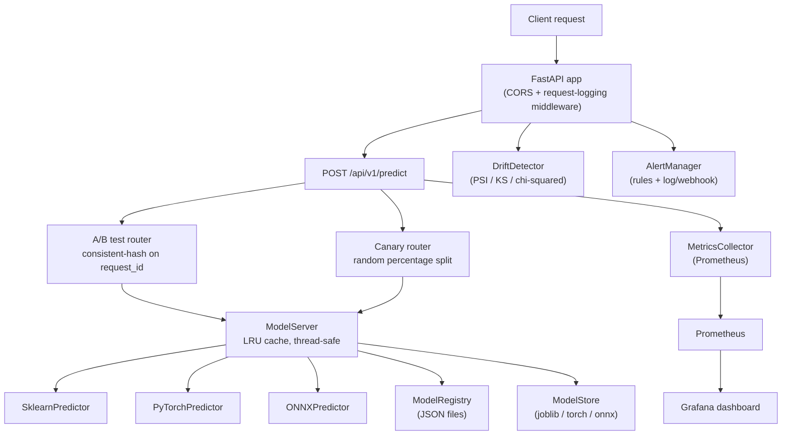

# ML Model Serving Platform

[](https://www.python.org/downloads/)
[](LICENSE)

A FastAPI service that loads trained machine learning models into memory and serves
predictions over HTTP. It keeps a file-backed registry of model versions, routes
prediction traffic through A/B tests and canary deployments, computes data drift
statistics, and exposes Prometheus metrics for a Grafana dashboard.

The code targets three model frameworks: scikit-learn, PyTorch, and ONNX Runtime.

## What "model serving" means here

Training a model produces a file (an artifact). Serving is the separate job of
loading that file into a running process and answering prediction requests. This
project splits that job into a few cooperating pieces:

- **Registry** (`ml_serving/registry/model_registry.py`): a JSON-file index of which
  models exist, what versions they have, and what lifecycle stage each version is in
  (staging, production, archived). It does not hold the model in memory; it tracks
  metadata on disk.
- **Store** (`ml_serving/registry/model_store.py`): reads and writes the actual model
  artifact files. scikit-learn artifacts use joblib, PyTorch uses `torch.save`/`torch.load`,
  ONNX loads into an `InferenceSession`.
- **Model server** (`ml_serving/serving/model_server.py`): holds loaded models in an
  `OrderedDict` with a lock, and evicts the least-recently-used model when the count
  reaches `MAX_LOADED_MODELS`. Each loaded model is wrapped in a predictor.
- **Predictors** (`ml_serving/serving/predictor.py`): one class per framework, all
  implementing the same `BasePredictor` interface (`predict`, `predict_batch`). A
  `PredictorFactory` picks the right class from the framework enum.
- **Router** (`ml_serving/routing/`): decides which model version a request should go
  to when an A/B test or canary is active.
- **Monitoring** (`ml_serving/monitoring/`): Prometheus counters/histograms/gauges,
  drift statistics, and a rule-based alert manager.

A prediction request flows like this: the `/api/v1/predict` handler checks for an
active A/B test that names the requested model, and if found rewrites the target
version using a consistent hash of the request ID. It then checks for an active canary
and may rewrite the target again. Finally it calls `model_server.predict(...)`, records
latency in the metrics collector, and returns the result. See
`ml_serving/api/routes/predict.py:20`.

## What actually runs by default

The serving path that runs out of the box is: registry plus store plus model server
plus the predictors, fronted by the FastAPI routes, with A/B routing, canary routing,
metrics, drift, and alerting available through the API.

Some modules exist in the codebase and are unit tested, but are **not wired into the
running request path**. They are libraries you can call from your own code, not
behaviors the default server applies:

- **Dynamic batching** (`ml_serving/serving/batching.py`): the `DynamicBatcher` class is
  fully implemented and tested, but nothing in the API or model server constructs it.
  The `/api/v1/predict` and `/api/v1/predict/batch` endpoints call the model server
  directly. There is no background batching loop running in the default app.
- **Shadow mode** (`ml_serving/routing/shadow.py`): `ShadowMode` is implemented and
  tested, but it is not part of the application state and has no API endpoints. Nothing
  in the running app starts a shadow comparison.
- **Preprocessing pipelines** (`ml_serving/serving/preprocessor.py`): the model server
  supports per-model pipelines via `register_pipeline(...)`, but no startup code or
  route registers one, so by default predictions are passed to the model unmodified.
- **Canary metrics**: canary routing works, but `CanaryDeployment.record_request(...)`
  and `auto_promote(...)` are not called from the predict path. Promotion and rollback
  are driven explicitly through the canary API endpoints, and the per-model canary
  metrics returned by the API stay at zero unless you record outcomes yourself.

These are accurate capabilities of the code; they are just not switched on automatically.

## Quick start

```bash
# Install (editable, with dev/test tools)
pip install -e ".[dev]"

# Train two sample scikit-learn models (Iris classifier + regression)
make train-samples

# Run the test suite
make test

# Start the API server with reload
make serve
```

`make serve` runs `uvicorn ml_serving.api.main:app --host 0.0.0.0 --port 8000 --reload`
(see `Makefile:31`).

### Docker Compose (API + Prometheus + Grafana)

```bash
make docker-up     # docker-compose -f docker/docker-compose.yml up -d
make docker-down   # tear down
```

- API: http://localhost:8000
- Prometheus: http://localhost:9090
- Grafana: http://localhost:3000 (admin password `admin`, set in `docker/docker-compose.yml:39`)

## First thing to open

Open the Swagger UI at **http://localhost:8000/docs**. FastAPI generates it from the
route definitions, so it lists every endpoint with request/response schemas and lets you
send a prediction without writing a client. The app does not disable it
(`ml_serving/api/main.py:91`).

## Architecture



## API reference

The app mounts 20 routes across five routers (`ml_serving/api/main.py:113`).

### Predictions (`ml_serving/api/routes/predict.py`)

| Method | Endpoint | Description |
|--------|----------|-------------|
| `POST` | `/api/v1/predict` | Single prediction; rewrites the target version if an A/B test or canary is active |
| `POST` | `/api/v1/predict/batch` | Predict over a list of inputs in one call |

### Model management (`ml_serving/api/routes/models.py`)

| Method | Endpoint | Description |
|--------|----------|-------------|
| `POST` | `/api/v1/models` | Register a new model version |
| `GET` | `/api/v1/models` | List registered models |
| `GET` | `/api/v1/models/{name}` | Get model details (latest, or a specific version) |
| `PUT` | `/api/v1/models/{name}/promote` | Promote a version to a stage |
| `DELETE` | `/api/v1/models/{name}/{version}` | Archive a version |
| `POST` | `/api/v1/models/{name}/load` | Load a version into the model server |
| `POST` | `/api/v1/models/{name}/unload` | Unload a version from memory |

### Experiments (`ml_serving/api/routes/experiments.py`)

| Method | Endpoint | Description |
|--------|----------|-------------|
| `POST` | `/api/v1/experiments/ab` | Create an A/B test |
| `GET` | `/api/v1/experiments/ab/{name}` | Get results, including a chi-squared p-value |
| `POST` | `/api/v1/experiments/ab/{name}/conclude` | Conclude the test and declare a winner |
| `POST` | `/api/v1/experiments/canary` | Start a canary deployment |
| `POST` | `/api/v1/experiments/canary/promote` | Advance the canary to its next traffic step |
| `POST` | `/api/v1/experiments/canary/rollback` | Roll the canary back |

### Monitoring and health

| Method | Endpoint | Description |
|--------|----------|-------------|
| `GET` | `/api/v1/monitoring/metrics` | Summary built from an in-process prediction log |
| `GET` | `/api/v1/monitoring/drift/{model}` | Drift report (returns 404 until reference data and samples are supplied) |
| `GET` | `/api/v1/monitoring/alerts` | Recently triggered alerts |
| `GET` | `/metrics` | Prometheus exposition format |
| `GET` | `/health` | Status plus per-loaded-model health |

## How the routing works

### A/B testing

Each A/B test names two model targets (`model_name:version`) and a traffic split.
A request is routed by hashing its `request_id` with SHA-256, taking the value modulo
10000, and comparing the resulting fraction against the split. The same request ID
always lands on the same model, which is what makes sessions sticky
(`ml_serving/routing/ab_testing.py:30`).

Results compare prediction accuracy against ground truth and report a p-value from a
two-proportion chi-squared test. The p-value is computed without SciPy: the chi-squared
survival function for 1 degree of freedom is evaluated as `erfc(sqrt(chi2)/sqrt(2))`
(`ml_serving/routing/ab_testing.py:197`, `ml_serving/routing/ab_testing.py:233`).

```bash
curl -X POST http://localhost:8000/api/v1/experiments/ab \
  -H "Content-Type: application/json" \
  -d '{"name": "v1_vs_v2", "model_a": "iris:v1", "model_b": "iris:v2", "traffic_split": 0.5}'

curl http://localhost:8000/api/v1/experiments/ab/v1_vs_v2
curl -X POST http://localhost:8000/api/v1/experiments/ab/v1_vs_v2/conclude
```

### Canary deployment

A canary routes a percentage of traffic to a new model and the rest to the current one.
The split is a random integer in 1..100 compared against the current percentage
(`ml_serving/routing/canary.py:74`). Promotion walks the fixed steps `[5, 25, 50, 100]`
(`ml_serving/routing/canary.py:14`); reaching 100 deactivates the canary. Rollback sets
the percentage to 0 and deactivates it (`ml_serving/routing/canary.py:127`).

```bash
curl -X POST http://localhost:8000/api/v1/experiments/canary \
  -H "Content-Type: application/json" \
  -d '{"current_model": "iris:v1", "canary_model": "iris:v2"}'

curl -X POST http://localhost:8000/api/v1/experiments/canary/promote
curl -X POST http://localhost:8000/api/v1/experiments/canary/rollback
```

## Drift detection

`DriftDetector` (`ml_serving/monitoring/drift_detector.py`) implements three tests with
no SciPy dependency:

- **PSI** (Population Stability Index): bins both distributions over a shared range and
  sums `(cur - ref) * log(cur / ref)` per bin (`ml_serving/monitoring/drift_detector.py:225`).
- **KS** (Kolmogorov-Smirnov): the maximum absolute difference between the two empirical
  CDFs (`ml_serving/monitoring/drift_detector.py:248`).
- **Chi-squared** for categorical counts, with a Wilson-Hilferty approximation for the
  p-value (`ml_serving/monitoring/drift_detector.py:260`).

`check_model_drift` only returns a report once you have called `set_reference(...)` and
added at least 10 samples for that model (`ml_serving/monitoring/drift_detector.py:150`).
Until then the drift endpoint returns 404.

## Metrics and the Grafana dashboard

`MetricsCollector` (`ml_serving/monitoring/metrics.py`) defines Prometheus instruments:
a prediction counter, prediction-latency and model-load histograms, batch-size histogram,
and gauges for active models, queue size, and drift score. The `/api/v1/monitoring/metrics`
summary (count, error rate, average and p50/p99 latency per model) is computed from an
in-process Python list of recent predictions, not from Prometheus
(`ml_serving/monitoring/metrics.py:126`).

The dashboard file `grafana/dashboards/model_serving.json` is provisioned into the Grafana
container by the compose stack.

## Configuration

Settings load from environment variables or a `.env` file
(`ml_serving/config/settings.py`).

| Variable | Default | Meaning |
|----------|---------|---------|
| `MODEL_STORE_PATH` | `./model_artifacts` | Where artifacts are stored on disk |
| `REGISTRY_PATH` | `./model_registry` | Where registry JSON files live |
| `MAX_LOADED_MODELS` | `10` | LRU capacity of the model server |
| `BATCH_TIMEOUT_MS` | `50` | Used by `DynamicBatcher` when you construct one |
| `BATCH_MAX_SIZE` | `32` | Used by `DynamicBatcher` when you construct one |
| `PROMETHEUS_PORT` | `9090` | Declared in settings |
| `GCP_PROJECT` | (empty) | Required by the Cloud Run deploy script |
| `GCP_REGION` | `us-central1` | GCP region |
| `AWS_REGION` | `us-east-1` | Declared in settings; not used by any serving code |
| `S3_BUCKET` | (empty) | Declared in settings; not used by any serving code |
| `API_HOST` | `0.0.0.0` | Server host |
| `API_PORT` | `8000` | Server port |
| `API_WORKERS` | `1` | Declared in settings |
| `LOG_LEVEL` | `INFO` | Logging level |

`BATCH_TIMEOUT_MS` and `BATCH_MAX_SIZE` only take effect if you instantiate
`DynamicBatcher` yourself; the default app does not.

## Cloud deployment

The container image is one artifact you can run on any of the three major clouds. Only
one of them has deployment configuration committed in this repository.

- **Google Cloud (Cloud Run): configured in the repo.** `.github/workflows/cd.yml`
  builds and pushes the image to GitHub Container Registry, then runs `gcloud run deploy`
  to a `-staging` service, smoke-tests `/health`, and promotes to production. The
  `CloudRunDeployer` class (`ml_serving/deployment/cloud_run.py`) wraps the same `gcloud`
  commands for local use, and `scripts/deploy.py --target cloud-run` drives it with a
  cost estimate.
- **AWS (SageMaker or ECS): not configured.** `boto3` is listed as a dependency and the
  settings expose `AWS_REGION` and `S3_BUCKET`, but no code reads them and there is no
  AWS workflow or task definition. Running on ECS or SageMaker would reuse the same
  `docker/Dockerfile` image and require its own config that does not exist yet.
- **Azure (ML Studio or Container Apps): not configured.** There is no Azure code or
  workflow. The same container image would run on Azure Container Apps, but you would
  need to add the deployment config.

The Docker image is a multi-stage build that installs the package in a builder stage,
copies it into a slim runtime, runs as a non-root user, and defines a `/health`
healthcheck (`docker/Dockerfile`).

## Local Docker deployment

```bash
make deploy-local    # python scripts/deploy.py --target local --action deploy -y
make deploy-status   # checks http://localhost:8000/health
```

`DockerDeployer` (`ml_serving/deployment/docker_deploy.py`) shells out to `docker` and
`docker-compose`. The CLI rollback action for Cloud Run is intentionally a no-op message:
`RollbackManager` (`ml_serving/deployment/rollback.py`) needs checkpoint history from a
running session, so rollback is done through code, not the CLI (`scripts/deploy.py:165`).

## Project layout

```
ml_serving/
  config/        Pydantic settings
  registry/      JSON registry, artifact store, pydantic schemas
  serving/       predictors, model server, preprocessor, batcher
  routing/       A/B testing, canary, shadow mode
  monitoring/    Prometheus metrics, drift detector, alert manager
  api/           FastAPI app, middleware, routes, request/response schemas
  deployment/    Cloud Run, local Docker, rollback
scripts/         deploy.py CLI
tests/
  unit/          180 unit tests
  integration/   33 integration tests
models/sample/   sample model training script
docker/          Dockerfile, docker-compose, prometheus.yml
grafana/         dashboard JSON
docs/            longer-form guides
```

## Tech stack

| Layer | Technology |
|-------|-----------|
| API | FastAPI, Uvicorn |
| Model frameworks | scikit-learn, PyTorch, ONNX Runtime |
| Numerics | NumPy, Pandas |
| Monitoring | prometheus-client, Grafana |
| Config | pydantic-settings |
| Logging | structlog |
| sklearn serialization | joblib |
| HTTP client | httpx |
| Deployment | Docker, Google Cloud Run |
| CI/CD | GitHub Actions |
| Tests | pytest, pytest-asyncio, pytest-cov |
| Lint/format/types | Ruff, mypy |

## Testing

```bash
make test        # pytest tests/ -v
make test-cov    # adds coverage, term + html report
```

The suite contains 213 test functions: 180 under `tests/unit/` and 33 under
`tests/integration/`. The CI workflow runs them on Python 3.11 and 3.12 with
`--cov-fail-under=80` (`.github/workflows/ci.yml:36`).

## Development

```bash
make lint        # ruff check
make format      # ruff format + ruff check --fix
make typecheck   # mypy
```

## Algorithms and methods, with sources

| Claim | Source |
|-------|--------|
| Consistent-hash A/B routing via SHA-256 modulo 10000 | `ml_serving/routing/ab_testing.py:30` |
| Two-proportion chi-squared statistic for A/B results | `ml_serving/routing/ab_testing.py:197` |
| Chi-squared p-value via `erfc(sqrt(x)/sqrt(2))`, no SciPy | `ml_serving/routing/ab_testing.py:233` |
| Canary promotion steps `[5, 25, 50, 100]` | `ml_serving/routing/canary.py:14` |
| Canary random percentage routing | `ml_serving/routing/canary.py:74` |
| Canary rollback deactivates and zeroes percentage | `ml_serving/routing/canary.py:127` |
| Canary auto-promote vs error threshold | `ml_serving/routing/canary.py:134` |
| PSI computation over shared-range bins | `ml_serving/monitoring/drift_detector.py:225` |
| Kolmogorov-Smirnov statistic (max CDF gap) | `ml_serving/monitoring/drift_detector.py:248` |
| Chi-squared p-value via Wilson-Hilferty approximation | `ml_serving/monitoring/drift_detector.py:260` |
| Drift needs reference data plus >= 10 samples | `ml_serving/monitoring/drift_detector.py:150` |
| LRU eviction at `MAX_LOADED_MODELS` capacity | `ml_serving/serving/model_server.py:235` |
| Per-framework predictor selection via factory | `ml_serving/serving/predictor.py:277` |
| PyTorch softmax for multi-class probabilities | `ml_serving/serving/predictor.py:168` |
| Dynamic batching by size or timeout (library, unwired) | `ml_serving/serving/batching.py:106` |
| Shadow mode fire-and-forget comparison (library, unwired) | `ml_serving/routing/shadow.py:65` |
| Metrics summary computed from in-process log, not Prometheus | `ml_serving/monitoring/metrics.py:126` |
| Alert rules with cooldown and log/webhook actions | `ml_serving/monitoring/alerting.py:114` |
| Cloud Run cost estimate formula | `ml_serving/deployment/cloud_run.py:254` |
| Prediction routing checks A/B then canary | `ml_serving/api/routes/predict.py:20` |
| 20 mounted routes | `ml_serving/api/main.py:113` |

## License

MIT
